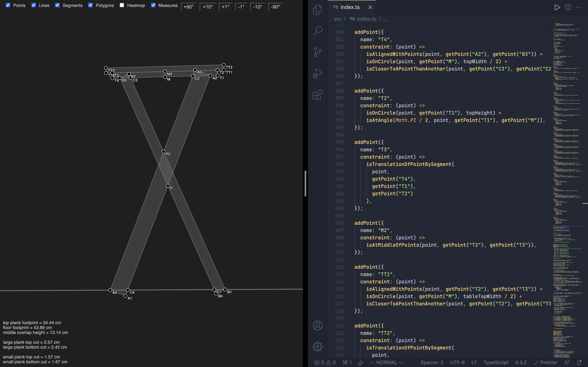

# Geometry Constraints

Create geometry through mathematical constraints applied on points.

## Example

The constraints of the example geometry below are in the source code.

## Features

| Feature           | Status                                      |
| ----------------- | ------------------------------------------- |
| Constraint solver | ✅                                          |
| Viewer            | ✅ (pan ✅, zoom ✅, tilt ✅, settings ✅)  |
| Editor            | ❌ (edit source code to change constraints) |
| Points            | ✅                                          |
| Lines             | ✅                                          |
| Segments          | ✅ (constraints ✅, viewer ✅)              |
| Polygons          | ✅                                          |
| Circles           | 🛠 (constraints ✅, viewer ❌)               |
| Angles            | ✅                                          |
| Example           | ✅                                          |
